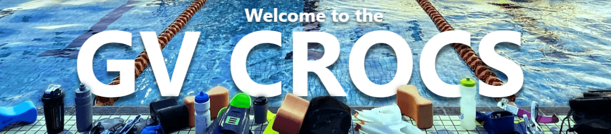
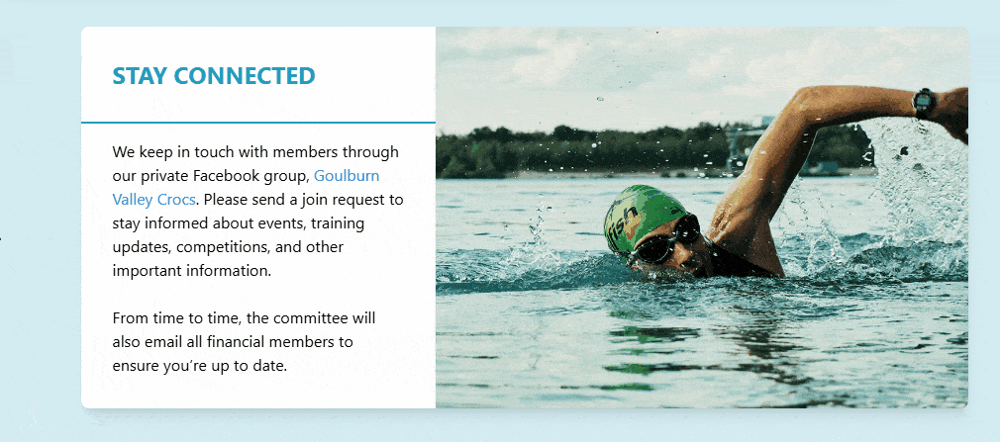
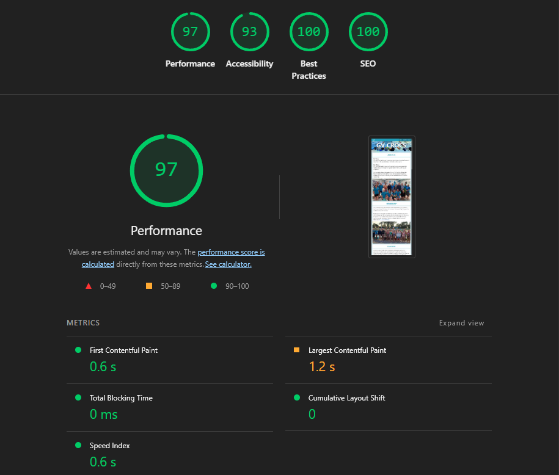

   

## Why

The Goulburn Valley Crocs Swim Club needed a simple website to provide essential information to new members and anyone interested in joining the club. The goal was to create a central place where visitors could find contact details, training information, calendar updates, and learn what the club is about. All without requiring ongoing maintenance or hosting costs.

## How

The site was designed with a minimal tech stack: HTML, Tailwind CSS and a single JavaScript function for smooth scrolling.
To mitiage hosting costs entirely, a backend was omitted. Instead, Formspree was used for the contact from and an embedded Google Calendar for the schedule.

The site is hosted on **GitHub Pages** for free. The only ongoing cost is the domain name.

## Outcome

The final result is a responsive, visually clean website that works well across devices and performs efficiently. It serves as a low-cost, low-maintenance solution for the club's online presence. Visitors can contact the committee, check training times, and learn more about the club without friction.

The live website is available at: 🌐 [https://gvcrocs.org](https://gvcrocs.org)

## Maintenance and contributions

This project was built by [Sam Muller](https://github.com/SamTheSomebody). The code is made public for transparency, but contributions are not being accepted and no further development is planned.
